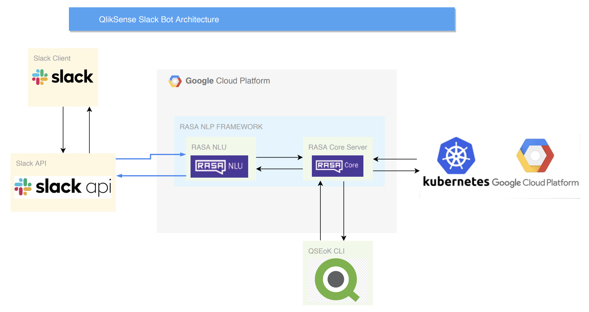

# Qlik Sense Slack Bot Documentation

Make sure you clone and install the Qlik Sense CLI: https://github.com/qlik-oss/sense-installer

#### Functions/Commands Supported by Slack Bot
- [x] View Custom Resource (CR)
- [x] View Custom Resource Definition (CRD)
- [X] Edit CR
- [X] Perform Deployment Preflight Checks
- [X] Set periodic notifications for Logs
- [X] View Visualizations of Kubernetes Cluster
- [X] Perform Deployment Preflight Checks
- [X] List All Contexts
- [ ] Perform all Preflight Checks
- [ ] Pull or Push Images to Cluster
- [ ] Install Qlik Sense

